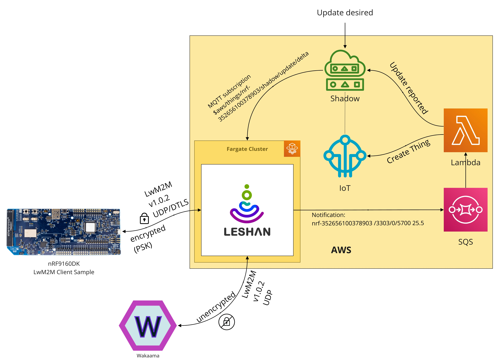
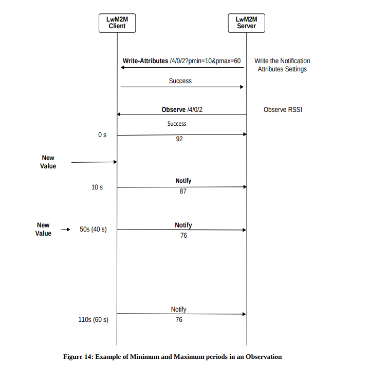
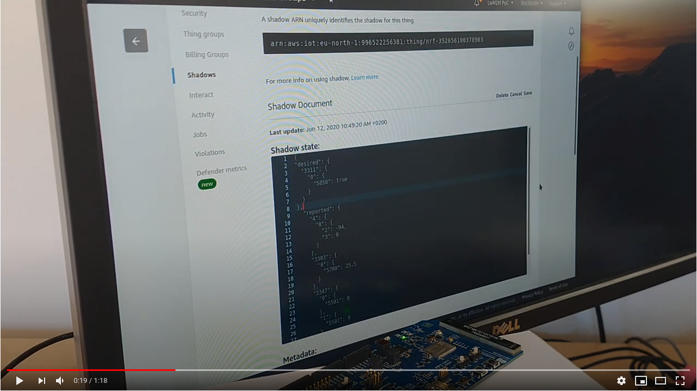

# Leshan LwM2M AWS IoT Gateway


[](https://github.com/semantic-release/semantic-release)
[](http://commitizen.github.io/cz-cli/)
[](https://github.com/prettier/prettier/)
[](https://github.com/typescript-eslint/typescript-eslint)

Use [Eclipse Leshan](https://github.com/eclipse/leshan) as a LwM2M gateway to
[AWS IoT](https://aws.amazon.com/iot/).

## Running in Docker

    docker build --pull -t coderbyheart/leshan-aws .

Make these environment variable available:

> ℹ️ Linux users can use [direnv](https://direnv.net/) to simplify the process.

    export AWS_REGION=<...>
    export AWS_QUEUE_URL=<...>
    export AWS_IOT_ENDPOINT=<...>
    export AWS_ACCESS_KEY_ID=<...>
    export AWS_SECRET_ACCESS_KEY=<...>

    docker run \
        -e AWS_QUEUE_URL \
        -e AWS_IOT_ENDPOINT \
        -e AWS_REGION \
        -e AWS_ACCESS_KEY_ID \
        -e AWS_SECRET_ACCESS_KEY \
        --rm --net=host -P coderbyheart/leshan-aws

## Deploy to AWS

Make these environment variable available:

> ℹ️ Linux users can use [direnv](https://direnv.net/) to simplify the process.

    export AWS_REGION=<...>
    export AWS_ACCESS_KEY_ID=<Access Key ID of the service account>
    export AWS_SECRET_ACCESS_KEY=<Secret Access Key of the service account>

Install dependencies

    npm ci

Set the ID of the stack

    export STACK_PREFIX="${STACK_PREFIX:-leshan}"

Deploy the ECR stack to an AWS Account

    npx cdk -a 'node dist/cdk-ecr.js' deploy ${STACK_PREFIX}-ecr

Deploy the source code stack to an AWS Account

    npx cdk -a 'node dist/cdk-sourcecode.js' deploy

Prepare the account for CDK resources:

    npx cdk bootstrap

Publish the docker image to AWS Elastic Container Registry

    ECR_REPOSITORY_NAME=`aws cloudformation describe-stacks --stack-name ${STACK_PREFIX}-ecr | jq -r '.Stacks[0].Outputs[] | select(.OutputKey == "repositoryName") | .OutputValue'`
    ECR_REPOSITORY_URI=`aws cloudformation describe-stacks --stack-name ${STACK_PREFIX}-ecr | jq -r '.Stacks[0].Outputs[] | select(.OutputKey == "repositoryUri") | .OutputValue'`
    aws ecr get-login-password --region ${AWS_REGION} | docker login --username AWS --password-stdin ${ECR_REPOSITORY_URI}
    docker tag coderbyheart/leshan-aws:latest ${ECR_REPOSITORY_URI}:latest
    docker push ${ECR_REPOSITORY_URI}:latest

Deploy the server stack to an AWS account

    npx cdk deploy '*'

## Continuous Deployment

Continuous Deployment of releases is done
[through GitHub Actions](.github/workflows/cd.yaml). Configure these secrets:

- `AWS_REGION`: Region where the stack is deployed
- `AWS_ACCESS_KEY_ID`: Access key ID for the CD user
- `AWS_SECRET_ACCESS_KEY`: Secret access key for the CD user
- `USER_GITHUB_TOKEN_FOR_ACTION_TRIGGER`: In order to be able to trigger this
  action, a GitHub user token with the permissions `public_repo`, `repo:status`,
  `repo_deployment` is needed (the default Actions credentials
  [can't trigger other Actions](https://help.github.com/en/actions/reference/events-that-trigger-workflows#triggering-new-workflows-using-a-personal-access-token)).

Afterwards the [Test Action](.github/workflows/test.yml) will trigger a
deployment.

## Deploying a new version of the server manually

Publish a new version of the image to ECR (see above), then trigger a new
deployment:

    SERVICE_ID=`aws cloudformation describe-stacks --stack-name ${STACK_PREFIX} | jq -r '.Stacks[0].Outputs[] | select(.OutputKey == "fargateServiceArn") | .OutputValue'`
    CLUSTER_NAME=`aws cloudformation describe-stacks --stack-name ${STACK_PREFIX} | jq -r '.Stacks[0].Outputs[] | select(.OutputKey == "clusterArn") | .OutputValue'`
    aws ecs update-service --service $SERVICE_ID --cluster $CLUSTER_NAME --force-new-deployment

## Architecture

> The scope of this proof-of-concept was to evaluate how to provide AWS IoT
> features via an LwM2M interface.

[](https://miro.com/app/board/o9J_kqh0Hfs=/)

This project provides
[a modified version](https://github.com/coderbyheart/leshan-aws-gateway) of the
[Eclipse Leshan Demo Server](https://github.com/eclipse/leshan/blob/0facbf9ad5635f79de6b23f319bf4a7468e889ba/leshan-server-demo/src/main/java/org/eclipse/leshan/server/demo/LeshanServerDemo.java)
which
[implements LwM2M v1.0.2](https://github.com/eclipse/leshan/wiki/LWM2M-Supported-features)
in a Docker container running on AWS Fargate. Fargate does not provide IPv6
support yet, so devices have to connect using IPv4.

> _Note:_ Leshan can be deployed in a
> [cluster setup](https://github.com/eclipse/leshan/wiki/Using-Leshan-server-in-a-cluster)
> but this is beyond the scope of this proof-of-concept and a cluster setup
> would be transparent to the device and the AWS IoT side anyway.

### Security

The security settings are unmodified, so devices can connect to the server
unencrypted (e.g. with [Wakaama](https://www.eclipse.org/wakaama/)
`./lwm2mclient -c -4 -h <ip>`), with pre-shared-keys (e.g. with the
[nRF9160 LwM2M client sample](https://developer.nordicsemi.com/nRF_Connect_SDK/doc/latest/nrf/samples/nrf9160/lwm2m_client/README.html)),
Raw-Public Key or X.509 certificates.

Authentication is handled on the LwM2M server side, and does not involve AWS
IoT. It does not allow to retrieve private keys of X.509 certificates any way so
it is not a suitable storage for device credentials. Because the provisioning of
certificates will differ greatly depending on the use case this step is not
covered in this proof-of-concept. It is simply assumed that the necessary
credentials exist when the device connects to the LwM2M server.

### Device → Cloud (`Read`)

LwM2M has the concept of notifications to send data from the device to the
server, but this needs to be initiated from the server side:



_LwM2M Notifications.
([Source](http://www.openmobilealliance.org/release/LightweightM2M/V1_0_2-20180209-A/OMA-TS-LightweightM2M-V1_0_2-20180209-A.pdf))_

Therefore the server needs to create an observation after the device connects
for the device to start sending e.g. temperature readings to the server.

This has been implemented in the LwM2M server,
[a list of _well known_ resources is observed after a device connects](https://github.com/coderbyheart/leshan-aws-gateway/blob/aws-bridge/leshan-server-demo/src/main/java/org/eclipse/leshan/server/demo/LeshanServerDemo.java#L540-L545):

```java
ArrayList<int[]> paths = new ArrayList<int[]>();
paths.add(new int[]{3, 0, 9}); // Observe battery
paths.add(new int[]{4, 0, 2}); // Observe radio signal strength
paths.add(new int[]{3303, 0, 5700}); // Observe temperature
paths.add(new int[]{3347, 0, 5501}); // Observe button 1 counter
paths.add(new int[]{3347, 1, 5501}); // Observe button 2 counter
observe(lwServer, registration, paths);
```

This means servers need to have _some_ knowledge about the purpose of the
devices which connect, and which observations to create. However in a typical
IoT product scenario this is not an issue because it can be determined which
resources are relevant for the given business case to observe. General purpose
servers where users can connect arbitrary devices to need to enable those users
be able to provide a set of resource they whish to observe by default. The
implemented device write further down provides an example how to solve this
through the AWS IoT Device Shadow.

After an observation has been successfully created, incoming notifications are
pushed into an SQS queue. A lambda function subscribes to this queue and creates
a new AWS IoT Thing if it does not yet exist in order to use its Shadow for
storing the resource values. The resource value from the notification is stored
in a nested object:

```json
{
  "reported": {
    "4": {
      "0": {
        "2": 80
      }
    }
  }
}
```

_Resource /4/0/2 (Connectivity Monitoring - Radio Signal Strength)_

The LwM2M server could directly interact with the shadow, but to separate the
concerns it has been moved outside of the LwM2M Gateway's scope. After all, it
is not necessary to use the AWS IoT shadow at all and resource values could be
stored in a different database or trigger a notification without being
persisted.

### Cloud → Device (`Write`)

_Writing_ to a LwM2M device happens when the `desired` property is changed in
the AWS IoT shadow for a specific device. The LwM2M server subscribes to the
`$aws/things/<device id>/shadow/update/delta` topic when a device connects and
issues write requests to the device via LwM2M for every incoming delta. It also
reports the write back to the AWS IoT shadow using MQTT. The LwM2M server is
effectively in charge of maintaining the correct device state based on the
device's AWS IoT Shadow state. The implementation in this proof-of-concept
assumes that all writes are successful and does not handle timeouts, or
non-existent resources.

Below is a recording of turning the LED on the
[nRF9160 LwM2M client sample](https://developer.nordicsemi.com/nRF_Connect_SDK/doc/latest/nrf/samples/nrf9160/lwm2m_client/README.html)
on and off by setting the respective resource in the AWS IoT shadow:

```json
"desired": {
  "3311": {
    "0": {
      "5850": true
    }
  }
}
```

[](https://www.youtube.com/watch?v=shnSlLcAPbE)
